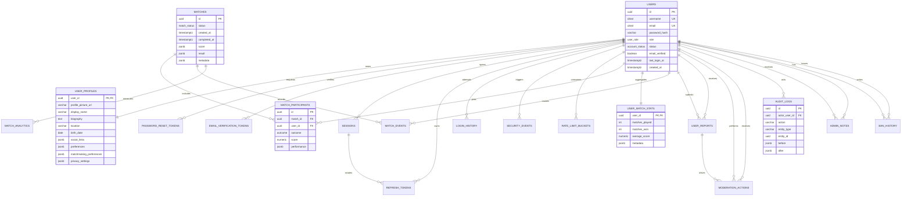

# Prelude relational database schema

This schema targets PostgreSQL 14+ and Prisma ORM for a modern Prelude web application. It uses UUID primary keys, normalized user/account tables, hashed token storage, JSONB only for intentionally flexible settings/metadata, and indexed history tables for auditability and operational security.

## Complete ERD

## Table definitions, primary keys, foreign keys, and indexes

| Table | Purpose | Primary key | Important foreign keys | Recommended indexes and constraints |
| --- | --- | --- | --- | --- |
| `users` | Canonical account record with UUID identity, username, email, password hash, role, account status, verification state, and login timestamps. | `id` | None | Unique `username`, unique `email`; indexes on `(role, status)`, `created_at`, and `last_login_at`. |
| `user_profiles` | User-facing profile and flexible preferences. `birth_date` is stored instead of a mutable `age`; age can be computed by the app. | `user_id` | `user_id -> users.id ON DELETE CASCADE` | Indexes on `display_name`, `location`; GIN indexes on `social_links`, `preferences`, `matchmaking_preferences`, and `privacy_settings`. |
| `password_reset_tokens` | Password reset flow with hashed, expiring one-time tokens. | `id` | `user_id -> users.id ON DELETE CASCADE` | Unique `token_hash`; index on `(user_id, status, expires_at)`. |
| `email_verification_tokens` | Email verification flow with hashed, expiring one-time tokens. | `id` | `user_id -> users.id ON DELETE CASCADE` | Unique `token_hash`; index on `(user_id, status, expires_at)`. |
| `sessions` | Server-side session state and device metadata. | `id` | `user_id -> users.id ON DELETE CASCADE` | Unique `session_token_hash`; indexes on `(user_id, status, expires_at)` and `expires_at`. |
| `refresh_tokens` | Refresh token rotation and revocation. | `id` | `user_id -> users.id ON DELETE CASCADE`; `session_id -> sessions.id ON DELETE SET NULL`; `replaced_by_token_id -> refresh_tokens.id ON DELETE SET NULL` | Unique `token_hash`; indexes on `(user_id, status, expires_at)` and `session_id`. |
| `login_history` | Successful and failed login attempts, including attempts that do not map to a known user. | `id` | `user_id -> users.id ON DELETE SET NULL` | Indexes on `(user_id, created_at)`, `(email_attempted, created_at)`, and `(ip_address, created_at)`. |
| `security_events` | Security audit trail for events such as suspicious login, MFA failure, token reuse, or privilege change. | `id` | `user_id -> users.id ON DELETE SET NULL` | Indexes on `(user_id, created_at)`, `(event_type, created_at)`, `(severity, created_at)`; GIN index on `metadata`. |
| `rate_limit_buckets` | Persistent API/login throttling counters per key, route, and time window. | `id` | `user_id -> users.id ON DELETE CASCADE` | Unique `(key, route, window_start)`; indexes on `(user_id, route, window_start)` and `blocked_until`. |
| `matches` | PreludeMatch record with lifecycle status, timestamps, scores, result payload, and metadata. | `id` | None | Indexes on `(status, created_at)`, `completed_at`; GIN index on `metadata`. |
| `match_participants` | Join table for users in a match, with per-user outcome, score, rank, and performance details. | `id` | `match_id -> matches.id ON DELETE CASCADE`; `user_id -> users.id ON DELETE CASCADE` | Unique `(match_id, user_id)`; indexes on `(user_id, joined_at)` and `(match_id, outcome)`; GIN index on `performance`. |
| `user_match_stats` | Denormalized per-user aggregate stats for fast leaderboards and dashboards. | `user_id` | `user_id -> users.id ON DELETE CASCADE` | Indexes on `matches_played` and `average_score`; checks keep totals non-negative and internally consistent. |
| `match_events` | Append-only match history timeline for status transitions, scoring updates, and participant events. | `id` | `match_id -> matches.id ON DELETE CASCADE`; `user_id -> users.id ON DELETE SET NULL` | Indexes on `(match_id, created_at)` and `(event_type, created_at)`. |
| `match_analytics` | Metric store for match analytics and BI rollups. | `id` | `match_id -> matches.id ON DELETE CASCADE` | Indexes on `(match_id, metric_name, recorded_at)` and `(metric_name, recorded_at)`; GIN index on `dimensions`. |
| `audit_logs` | Administrative and sensitive data-change audit trail. | `id` | `actor_user_id -> users.id ON DELETE SET NULL` | Indexes on `(actor_user_id, created_at)`, `(entity_type, entity_id, created_at)`, and `(action, created_at)`; GIN index on `metadata`. |
| `user_reports` | User-submitted reports for abuse, safety, or support escalation. | `id` | `reporter_user_id -> users.id ON DELETE SET NULL`; `target_user_id -> users.id ON DELETE SET NULL` | Indexes on `(status, created_at)`, `(target_user_id, created_at)`, and `(reporter_user_id, created_at)`. |
| `moderation_actions` | Moderator/admin actions linked optionally to reports. | `id` | `actor_user_id -> users.id ON DELETE SET NULL`; `target_user_id -> users.id ON DELETE SET NULL`; `report_id -> user_reports.id ON DELETE SET NULL` | Indexes on `(target_user_id, created_at)`, `(actor_user_id, created_at)`, and `report_id`. |
| `admin_notes` | Internal notes on user accounts. | `id` | `target_user_id -> users.id ON DELETE CASCADE`; `author_user_id -> users.id ON DELETE SET NULL` | Indexes on `(target_user_id, created_at)` and `(author_user_id, created_at)`. |
| `ban_history` | Ban/suspension history with issuer, effective dates, and lift date. | `id` | `user_id -> users.id ON DELETE CASCADE`; `banned_by_user_id -> users.id ON DELETE SET NULL` | Indexes on `(user_id, starts_at)` and `ends_at`. |
| `system_events` | Application-wide operational events not tied to a specific user account. | `id` | None | Indexes on `(event_type, created_at)` and `(severity, created_at)`. |

## Relationship notes

- `users` is the root identity table. Deleting a user cascades to private owned records such as profile data, sessions, tokens, rate-limit buckets, match participation, admin notes received, and ban history.
- Administrative and audit records generally use `ON DELETE SET NULL` for actor/reporting users so records remain historically useful even if an account is removed.
- PreludeMatch is normalized into `matches` for match lifecycle, `match_participants` for participating users and per-user results, `match_events` for historical records and replayable timelines, `user_match_stats` for fast profile/leaderboard reads, and `match_analytics` for aggregated metrics.
- Tokens and sessions store only hashes, never raw secrets. The application should hash reset tokens, verification tokens, session tokens, and refresh tokens before insert or lookup.
- Flexible JSONB fields are intentionally limited to preferences, privacy, social links, match metadata, and analytics dimensions. Core queryable account and moderation data remains relational.

## Scalability and operational guidance

- The schema is sized for 100,000+ users by using UUID primary keys, narrow foreign keys, composite indexes for common history queries, and denormalized aggregate stats for dashboards.
- Use cursor pagination over indexed columns such as `created_at`, `joined_at`, and `recorded_at` for history endpoints.
- Partition high-volume append-only tables later if needed: `login_history`, `security_events`, `match_events`, `match_analytics`, `audit_logs`, and `system_events` are strong candidates for monthly range partitioning.
- Keep `updated_at` columns synchronized in the application or with a shared PostgreSQL trigger if direct SQL writes will bypass Prisma.
- Store password hashes with a modern adaptive algorithm such as Argon2id or bcrypt, with unique salts and a migration plan for hash upgrades.

## Prisma schema and migration deliverables

- Prisma ORM schema: [`prisma/schema.prisma`](../prisma/schema.prisma)
- PostgreSQL migration SQL: [`prisma/migrations/20260601000000_init/migration.sql`](../prisma/migrations/20260601000000_init/migration.sql)

## Future expansion suggestions

1. Add MFA tables (`authenticators`, `webauthn_credentials`, `backup_codes`) once multi-factor authentication is introduced.
2. Add subscription/billing tables if Prelude plans and mentor access need transactional tracking.
3. Add mentor/student domain tables for college admissions workflows, such as colleges, applications, essays, tasks, deadlines, roadmap milestones, mentor sessions, and file uploads.
4. Add notification tables for email, SMS, in-app notifications, and user notification preferences.
5. Add content moderation tables for specific content objects when user-generated posts, chat rooms, or uploaded files become first-class entities.
6. Add data retention jobs and archival tables for security logs and analytics to keep primary tables fast.
7. Add row-level security policies for admin dashboards and internal tools if database access is shared across services.
